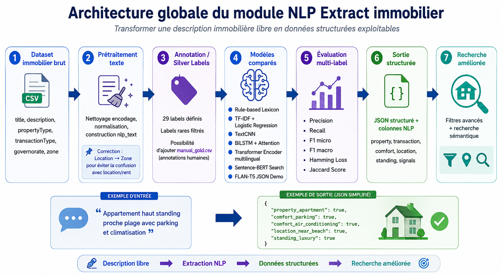
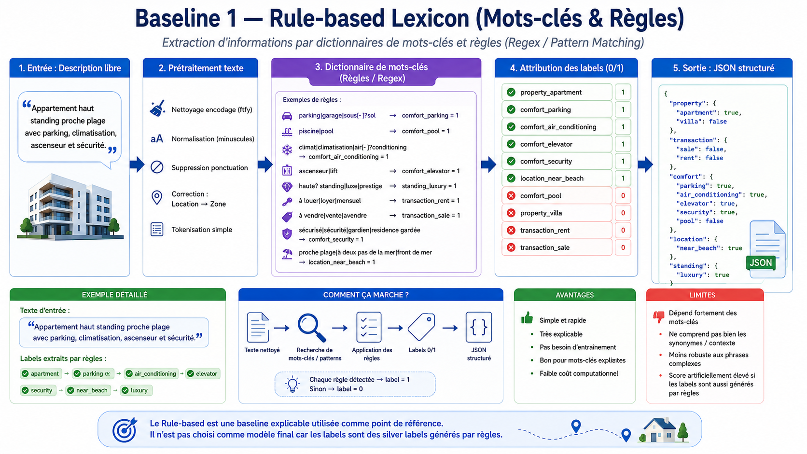
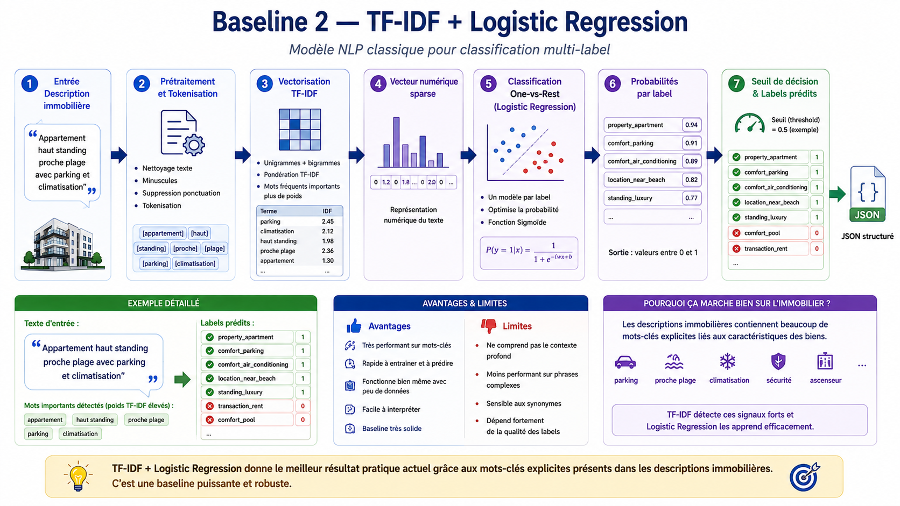
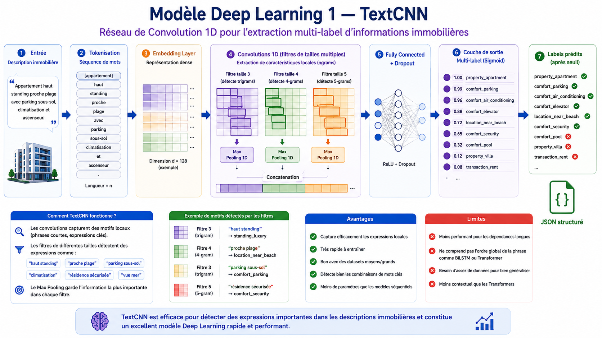
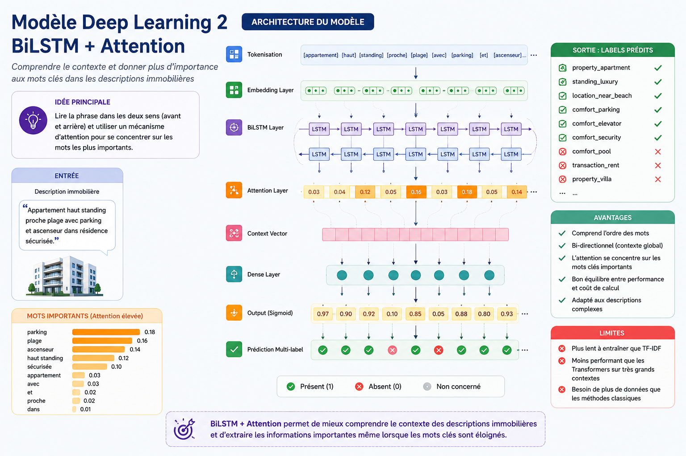
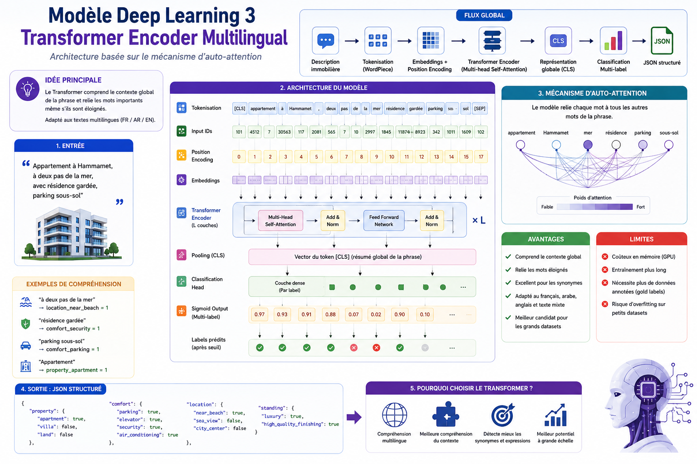
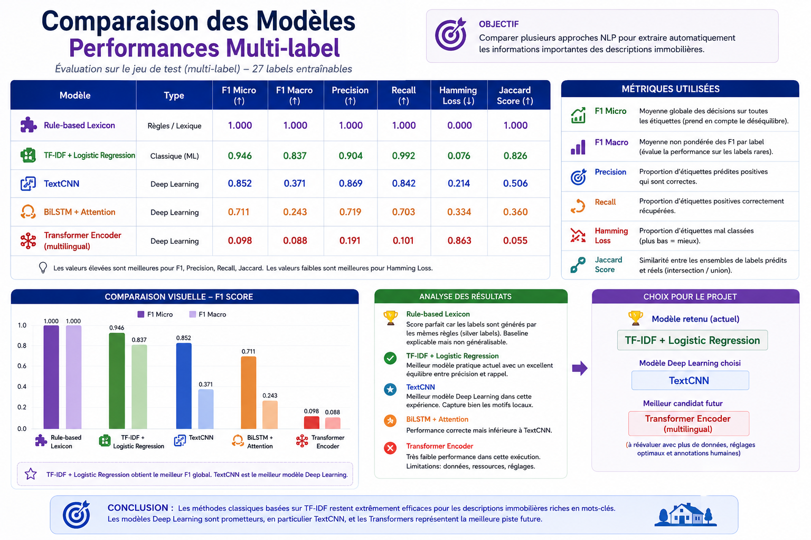

# 🏠 NLP Extract Immobilier — Multi-Label Information Extraction for Real Estate Descriptions

This project focuses on transforming free real estate descriptions into structured and exploitable data using Natural Language Processing techniques.

The main goal is to extract important real estate information from raw property descriptions and convert it into structured JSON fields that can be used for advanced filtering, semantic search, recommendation systems, analytics, and real estate intelligence.

---

## 📌 Project Overview

Real estate listings usually contain important information inside unstructured text descriptions.

Example:

```txt
Appartement haut standing proche plage avec parking et climatisation.
```

This description contains useful signals such as:

* Property type: apartment
* Standing: luxury / high standing
* Location: near beach
* Comfort: parking and air conditioning

The objective of this project is to automatically extract these signals and transform them into structured data.

Example structured output:

```json
{
  "property_apartment": true,
  "comfort_parking": true,
  "comfort_air_conditioning": true,
  "location_near_beach": true,
  "standing_luxury": true
}
```

---

## 🎯 Objective

The objective is to build and compare several NLP models for **multi-label classification** on Tunisian real estate descriptions.

The extracted labels can improve:

* Real estate search
* Advanced filtering
* Property recommendation
* Structured data generation
* Market analytics
* User experience

---

## 📊 Dataset

The project uses the dataset:

```txt
tunisia_realestate_cleaned.csv
```

Main columns used:

| Column            | Description             |
| ----------------- | ----------------------- |
| `title`           | Listing title           |
| `description`     | Real estate description |
| `propertyType`    | Type of property        |
| `transactionType` | Sale or rent            |
| `governorate`     | Tunisian governorate    |
| `zone`            | Local area / zone       |

A new NLP text field is created by combining useful textual information from the listing.

---

# 🧠 Global Architecture

The global architecture shows the full NLP pipeline, from raw real estate data to structured JSON output and improved search.



## Pipeline Steps

1. Raw real estate dataset
2. Text preprocessing
3. Annotation and silver label generation
4. Model comparison
5. Multi-label evaluation
6. Structured JSON output
7. Improved real estate search

---

# 🧹 Text Preprocessing

Before training the models, the text is cleaned and normalized.

Main preprocessing steps:

* Encoding correction
* Lowercasing
* Punctuation removal
* Text normalization
* Tokenization
* Construction of the `nlp_text` column
* Correction of ambiguity between location and rent
* Rare label filtering

Important correction:

```txt
Location → Zone
```

This avoids confusion between the French word **location**, which can mean rent, and location as a geographic position.

---

# 🏷️ Labeling Strategy

The project uses a **silver labeling strategy**.

A rule-based lexicon is used to automatically generate labels from keywords and patterns.

Examples:

| Text Signal                      | Extracted Label            |
| -------------------------------- | -------------------------- |
| parking / garage / sous-sol      | `comfort_parking`          |
| piscine / pool                   | `comfort_pool`             |
| climatisation / air conditioning | `comfort_air_conditioning` |
| ascenseur / lift                 | `comfort_elevator`         |
| haut standing / luxe / prestige  | `standing_luxury`          |
| proche plage / front de mer      | `location_near_beach`      |
| à louer / loyer / mensuel        | `transaction_rent`         |
| à vendre / vente                 | `transaction_sale`         |

Around **29 labels** were defined. Rare labels were filtered before model training.

---

# 🤖 Models Used

This project compares rule-based, classical machine learning, and deep learning approaches.

---

## 1. Baseline 1 — Rule-Based Lexicon

The first baseline uses dictionaries of keywords, regular expressions, and pattern matching rules.



### How It Works

1. The input is a free real estate description.
2. The text is cleaned and normalized.
3. Keyword rules and regex patterns are applied.
4. Each detected rule activates a label.
5. The final output is generated as structured JSON.

Example input:

```txt
Appartement haut standing proche plage avec parking, climatisation, ascenseur et sécurité.
```

Detected labels:

```txt
property_apartment = 1
comfort_parking = 1
comfort_air_conditioning = 1
comfort_elevator = 1
comfort_security = 1
location_near_beach = 1
standing_luxury = 1
```

### Advantages

* Simple and fast
* Very explainable
* No training required
* Good for explicit keywords
* Low computational cost

### Limitations

* Depends heavily on keywords
* Does not understand deep context
* Weak with synonyms
* Less robust for complex sentences
* Can produce artificially high scores when labels are generated by the same rules

---

## 2. Baseline 2 — TF-IDF + Logistic Regression

This model is a classical NLP machine learning approach for multi-label classification.



### Architecture

The pipeline is:

1. Real estate description input
2. Text preprocessing and tokenization
3. TF-IDF vectorization
4. Sparse numerical representation
5. One-vs-Rest Logistic Regression
6. Probability prediction per label
7. Threshold decision
8. Structured JSON output

### Why This Model Works Well

Real estate descriptions contain many explicit keywords such as:

* parking
* plage
* climatisation
* sécurité
* ascenseur
* haut standing

TF-IDF detects these strong signals, and Logistic Regression learns the relation between words and labels efficiently.

### Advantages

* Strong performance on keyword-rich descriptions
* Fast to train
* Fast to predict
* Easy to interpret
* Works well with limited data
* Very strong practical baseline

### Limitations

* Does not deeply understand context
* Sensitive to synonyms
* Depends on label quality
* Less powerful than Transformers for semantic understanding

---

## 3. Deep Learning Model 1 — TextCNN

TextCNN is a 1D convolutional neural network used to detect local patterns in text.



### Architecture

The model contains:

1. Input description
2. Tokenization
3. Embedding layer
4. Multiple 1D convolution filters
5. Max pooling
6. Concatenation
7. Fully connected layer
8. Dropout
9. Sigmoid output for multi-label classification

### Examples of Detected Patterns

| Local Expression    | Extracted Label       |
| ------------------- | --------------------- |
| haut standing       | `standing_luxury`     |
| proche plage        | `location_near_beach` |
| parking sous-sol    | `comfort_parking`     |
| résidence sécurisée | `comfort_security`    |

### Advantages

* Captures important local expressions
* Good for short real estate phrases
* Fast deep learning model
* Less complex than LSTM models
* Good candidate when descriptions contain repeated patterns

### Limitations

* Less powerful for long-distance dependencies
* Does not fully understand sentence order
* Needs enough data to generalize
* Less contextual than BiLSTM and Transformers

---

## 4. Deep Learning Model 2 — BiLSTM + Attention

BiLSTM + Attention is used to understand the context of the sentence and focus on the most important words.



### Main Idea

The BiLSTM reads the sentence in two directions:

* From left to right
* From right to left

The Attention layer gives higher importance to key words such as:

* parking
* plage
* ascenseur
* haut standing
* sécurisée

### Architecture

The model includes:

1. Tokenization
2. Embedding layer
3. Bidirectional LSTM layer
4. Attention layer
5. Context vector
6. Dense layer
7. Sigmoid output
8. Multi-label prediction

### Advantages

* Understands word order
* Uses bidirectional context
* Attention highlights important words
* Good for complex descriptions
* More contextual than TextCNN

### Limitations

* Slower to train than TF-IDF
* Needs more data than classical ML
* Less efficient than Transformers on large datasets
* Can underperform if the dataset is small or labels are noisy

---

## 5. Deep Learning Model 3 — Multilingual Transformer Encoder

The Transformer Encoder is based on the self-attention mechanism. It helps the model understand global context and relationships between distant words.



### Main Idea

The Transformer connects each word to all other words in the sentence using self-attention.

Example:

```txt
Appartement à Hammamet, à deux pas de la mer, avec résidence gardée et parking sous-sol.
```

The model can extract:

| Expression           | Label                 |
| -------------------- | --------------------- |
| à deux pas de la mer | `location_near_beach` |
| résidence gardée     | `comfort_security`    |
| parking sous-sol     | `comfort_parking`     |
| Appartement          | `property_apartment`  |

### Architecture

The Transformer pipeline includes:

1. Description input
2. WordPiece tokenization
3. Input IDs
4. Position encoding
5. Embeddings
6. Multi-head self-attention
7. Transformer encoder layers
8. CLS token representation
9. Classification head
10. Sigmoid output
11. Structured JSON output

### Advantages

* Understands global context
* Connects distant words
* Good with synonyms
* Supports multilingual text
* Strong future candidate for larger datasets

### Limitations

* Requires more computational resources
* Needs more annotated data
* Training is longer
* Can overfit on small datasets
* Needs better tuning for optimal results

---

# 📤 Structured JSON Output + Improved Search

The final result of the NLP pipeline is a structured JSON object that can be used by a search engine, API, frontend, or recommendation system.


Example JSON output:

```json
{
  "property": {
    "apartment": true,
    "villa": false,
    "studio": false
  },
  "transaction": {
    "rent": false,
    "sale": true
  },
  "comfort": {
    "parking": true,
    "air_conditioning": true,
    "elevator": false,
    "swimming_pool": false
  },
  "location": {
    "near_beach": true,
    "sea_view": true,
    "city_center": false
  },
  "standing": {
    "luxury": true,
    "high_quality_finishing": true
  },
  "signals": [
    "haut standing",
    "proche plage",
    "vue mer"
  ],
  "confidence": 0.92
}
```

---

## 🔎 Why Structured JSON Improves Search

The extracted JSON fields make the search system more intelligent.

Instead of searching only by raw keywords, the system can use precise filters such as:

* Apartment
* Villa
* Sale
* Rent
* Parking
* Air conditioning
* Elevator
* Swimming pool
* Near beach
* Sea view
* City center
* Luxury standing

This makes the search more accurate, more structured, and more useful for users.

---

# 📈 Model Evaluation

The models were evaluated using multi-label classification metrics.

| Metric        | Meaning                                                  |
| ------------- | -------------------------------------------------------- |
| F1 Micro      | Global F1 score across all labels                        |
| F1 Macro      | Average F1 score per label                               |
| Precision     | Percentage of predicted positive labels that are correct |
| Recall        | Percentage of true positive labels correctly detected    |
| Hamming Loss  | Ratio of wrong labels, lower is better                   |
| Jaccard Score | Similarity between predicted and real label sets         |

---

## 🏆 Model Comparison



| Model                            | Type            | F1 Micro | F1 Macro | Precision | Recall | Hamming Loss | Jaccard Score |
| -------------------------------- | --------------- | -------: | -------: | --------: | -----: | -----------: | ------------: |
| Rule-Based Lexicon               | Rules / Lexicon |    1.000 |    1.000 |     1.000 |  1.000 |        0.000 |         1.000 |
| TF-IDF + Logistic Regression     | Classical ML    |    0.946 |    0.837 |     0.904 |  0.992 |        0.076 |         0.826 |
| TextCNN                          | Deep Learning   |    0.852 |    0.371 |     0.869 |  0.842 |        0.214 |         0.506 |
| BiLSTM + Attention               | Deep Learning   |    0.711 |    0.243 |     0.719 |  0.703 |        0.334 |         0.360 |
| Transformer Encoder Multilingual | Deep Learning   |    0.098 |    0.088 |     0.191 |  0.101 |        0.863 |         0.055 |

---

# ✅ Final Model Choice

The Rule-Based Lexicon obtains perfect scores, but it is mainly used as a **silver label generation baseline**. Its score is not considered the best practical model because the labels are generated using similar rule logic.

The best practical model is:

```txt
TF-IDF + Logistic Regression
```

Reasons:

* Best practical balance between precision and recall
* Excellent F1 Micro score
* Strong F1 Macro score
* Very effective on real estate descriptions rich in explicit keywords
* Fast and robust
* Easy to interpret
* Suitable for the current dataset size

The best Deep Learning model in this experiment is:

```txt
TextCNN
```

The best future candidate is:

```txt
Multilingual Transformer Encoder
```

However, the Transformer requires:

* More annotated data
* Better hyperparameter tuning
* More computing resources
* More human-validated gold labels

---

# 📦 Generated Outputs

The notebook generates several useful files inside the `nlp_extract_artifacts/` folder.

```txt
nlp_extract_artifacts/
├── experiment_summary.json
├── model_comparison_results.csv
├── nlp_extracted_structured.csv
├── per_label_reports.csv
├── structured_json_samples.json
├── textcnn_model.keras
└── bilstm_attention_model.keras
```

## Output Description

| File                           | Description                                         |
| ------------------------------ | --------------------------------------------------- |
| `experiment_summary.json`      | Summary of the experiment configuration and results |
| `model_comparison_results.csv` | CSV file comparing all tested models                |
| `nlp_extracted_structured.csv` | Dataset enriched with extracted NLP labels          |
| `per_label_reports.csv`        | Detailed evaluation report per label                |
| `structured_json_samples.json` | Examples of structured JSON outputs                 |
| `textcnn_model.keras`          | Saved TextCNN model                                 |
| `bilstm_attention_model.keras` | Saved BiLSTM + Attention model                      |

---

# 📁 Project Structure

```txt
NLP-Extract-Immobilier/
├── README.md
├── NLP__Extract.ipynb
│
├── data/
│   └── tunisia_realestate_cleaned.csv
│
├── assets/
│   ├── architecture_global_nlp_extract.png
│   ├── baseline1_rule_based_lexicon.png
│   ├── baseline2_tfidf_logistic_regression.png
│   ├── model1_textcnn.png
│   ├── model2_bilstm_attention.png
│   ├── model3_transformer_encoder.png
│   ├── structured_json_search.png
│   └── model_comparison_multilabel.png
│
└── nlp_extract_artifacts/
    ├── experiment_summary.json
    ├── model_comparison_results.csv
    ├── nlp_extracted_structured.csv
    ├── per_label_reports.csv
    ├── structured_json_samples.json
    ├── textcnn_model.keras
    └── bilstm_attention_model.keras
```

---

# 🚀 How to Run the Project

## 1. Clone the Repository

```bash
git clone https://github.com/your-username/NLP-Extract-Immobilier.git
cd NLP-Extract-Immobilier
```

## 2. Install Dependencies

```bash
pip install pandas numpy scikit-learn matplotlib seaborn tensorflow keras
```

Optional dependencies:

```bash
pip install transformers sentence-transformers
```

## 3. Open the Notebook

```bash
jupyter notebook NLP__Extract.ipynb
```

Or open it directly with Google Colab.

---

# 🧪 Notebook Workflow

The notebook contains the following workflow:

1. Load the Tunisian real estate dataset
2. Clean and preprocess text
3. Build the `nlp_text` column
4. Generate silver labels using rule-based lexicon
5. Filter rare labels
6. Train TF-IDF + Logistic Regression
7. Train TextCNN
8. Train BiLSTM + Attention
9. Test Multilingual Transformer Encoder
10. Evaluate all models
11. Compare model performance
12. Generate structured JSON outputs
13. Export CSV, JSON, and model artifacts

---

# 🛠️ Technologies Used

## Programming

* Python
* Jupyter Notebook

## Data Processing

* Pandas
* NumPy

## Classical Machine Learning

* Scikit-learn
* TF-IDF
* Logistic Regression
* One-vs-Rest Classification

## Deep Learning

* TensorFlow
* Keras
* TextCNN
* BiLSTM
* Attention Mechanism

## NLP

* Regex
* Pattern Matching
* Tokenization
* Multi-label Classification
* Transformer Encoder
* Multilingual NLP

## Visualization

* Matplotlib
* Seaborn

---

# 🔮 Future Improvements

Possible future improvements:

* Add more manually annotated data
* Improve label quality with human validation
* Add Arabic and Tunisian dialect support
* Improve synonym detection
* Train a stronger multilingual Transformer
* Use a larger real estate dataset
* Add active learning for annotation
* Deploy the extractor as an API
* Connect the JSON output to a real estate recommendation system
* Integrate the extractor into EstateMind search engine

---

# 📌 Conclusion

This project demonstrates how NLP can transform unstructured real estate descriptions into structured, searchable, and exploitable data.

The best current practical model is **TF-IDF + Logistic Regression**.

The best Deep Learning model in this experiment is **TextCNN**.

The structured JSON output can significantly improve real estate search, filtering, recommendation, analytics, and user experience.

---

# 👨‍💻 Author

Developed by **Wael Ben Salem**.

---

# 📄 License

This project was developed for academic and research purposes.
